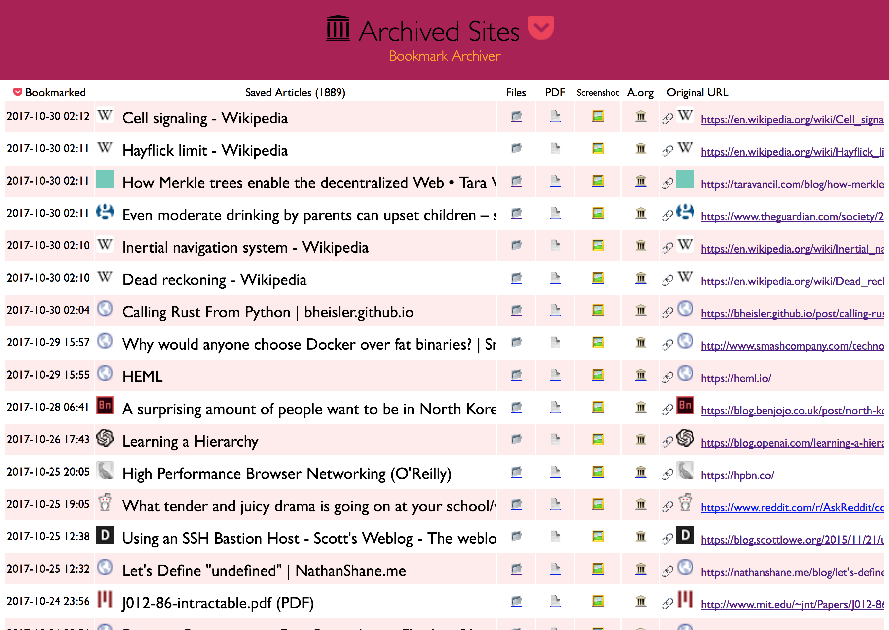

# Pocket Stream Archive  [](https://twitter.com/thesquashSH)

(Your own personal Way-Back Machine)

Save an archived copy of all websites you star using Pocket, indexed in an html file.  Powered by the new [headless](https://developers.google.com/web/updates/2017/04/headless-chrome) Google Chrome and good 'ol `wget`.



## Quickstart

`archive.py` is a script that takes a [Pocket](https://getpocket.com/export) export, and turns it into a browsable html archive that you can store locally or host online.

**Runtime:** I've found it takes about an hour to download 1000 articles, and they'll take up roughly 1GB.
Those numbers are from running it single-threaded on my i5 machine with 50mbps down.  YMMV.

**Dependencies:** `google-chrome --headless (59)`,` wget`, `python3`

```bash
# On Mac:
brew install Caskroom/versions/google-chrome-canary wget python3
ln -s "/Applications/Google Chrome Canary.app/Contents/MacOS/Google Chrome Canary" /usr/local/bin/google-chrome
# On Linux:
wget -q -O - https://dl-ssl.google.com/linux/linux_signing_key.pub | sudo apt-key add -
sudo sh -c 'echo "deb [arch=amd64] http://dl.google.com/linux/chrome/deb/ stable main" >> /etc/apt/sources.list.d/google-chrome.list'
apt update; apt install google-chrome-canary python3 wget
```

**Archiving:**

1. Download your pocket export file `ril_export.html` from https://getpocket.com/export
2. Download this repo `git clone https://github.com/pirate/pocket-archive-stream`
3. `cd pocket-archive-stream/`
4. `./archive.py ~/Downloads/ril_export.html`

It produces a folder `pocket/` containing an `index.html`, and archived copies of all the sites,
organized by timestamp.  For each sites it saves:

 - wget of site, e.g. `en.wikipedia.org/wiki/Example.html` with .html appended if not present
 - `sreenshot.png` 1440x900 screenshot of site using headless chrome
 - `output.pdf` Printed PDF of site using headless chrome

You can tweak parameters like screenshot size, file paths, timeouts, etc. in `archive.py`.
You can also tweak the outputted html index in `index_template.html`.  It just uses python
format strings (not a proper templating engine like jinja2), which is why the CSS is double-bracketed `{{...}}`.

**Live Updating:** (coming soon)

It's possible to pull links via the pocket API instead of downloading an html export.
Once I write a script to do that, we can stick this in `cron` and have it auto-update on it's own.

For now you just have to download `ril_export.html` and run `archive.py` each time it updates. The script
will run fast subsequent times because it only downloads new links that haven't been archived already.

## Publishing Your Archive

The pocket archive is suitable for serving on your personal server, you can upload the pocket
archive to `/var/www/pocket` and allow people to access your saved copies of sites.


Just stick this in your nginx config to properly serve the wget-archived sites:

```nginx
location /pocket/ {
    alias       /var/www/pocket/;
    index       index.html;
    autoindex   on;
    try_files   $uri $uri/ $uri.html =404;
}
```

Make sure you're not running any content as CGI or PHP, you only want to serve static files!

Urls look like: `https://sweeting.me/pocket/archive/1493350273/en.wikipedia.org/wiki/Dining_philosophers_problem`

## Info

This is basically an open-source version of [Pocket Premium](https://getpocket.com/premium) (which you should consider paying for!).
I got tired of sites I saved going offline or changing their URLS, so I started
archiving a copy of them locally now, similar to The Way-Back Machine provided
by [archive.org](https://archive.org).  Self hosting your own archive allows you to save
PDFs & Screenshots of dynamic sites in addition to static html, something archive.org doesn't do.

Now I can rest soundly knowing important articles and resources I like wont dissapear off the internet.

My published archive as an example: [sweeting.me/pocket](https://home.sweeting.me/pocket).

## Security WARNING

Hosting other people's site content has security implications for your domain, make sure you understand
the dangers of hosting other people's CSS & JS files [on your domain](https://developer.mozilla.org/en-US/docs/Web/Security/Same-origin_policy).  It's best to put this on a domain
of its own to slightly mitigate [CSRF attacks](https://en.wikipedia.org/wiki/Cross-site_request_forgery).

It might also be prudent to blacklist your archive in your `robots.txt` so that search engines dont index
the content on your domain.

## TODO

 - body text extraction using [fathom](https://hacks.mozilla.org/2017/04/fathom-a-framework-for-understanding-web-pages/)
 - auto-tagging based on important extracted words
 - audio & video archiving with `youtube-dl`
 - full-text indexing with elasticsearch
 - video closed-caption downloading for full-text indexing video content
 - automatic text summaries of article with summarization library
 - feature image extraction
 - http support (from my https-only domain)
