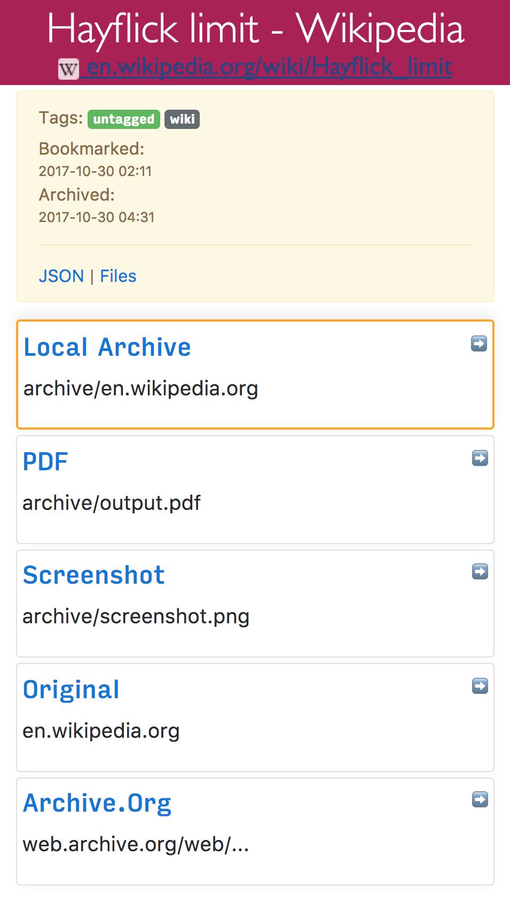

# Bookmark Archiver    [](https://github.com/pirate/bookmark-archiver) [](https://twitter.com/thesquashSH)

▶️ [Quickstart](#quickstart) | [Details](#details) | [Configuration](#configuration) | [Manual Setup](#manual-setup) | [Troubleshooting](#troubleshooting) | [Changelog](#changelog)

Save an archived copy of all websites you bookmark (the actual *content* of the sites, not just the list of bookmarks).

Outputs browsable static html archives of each site, a PDF, a screenshot, and a link to a copy on archive.org, all indexed in a nice html file.  
(Your own personal Way-Back Machine) [DEMO: sweeting.me/pocket](https://home.sweeting.me/pocket)

**Supports: Browser Bookmarks (Chrome, Firefox, Safari, IE, Opera), Pocket, Pinboard, Reddit, Wallabag, Shaarli, Delicious, Instapaper, Unmark.it, RSS, and more!**

<br/>

## Quickstart

**1. Get your bookmarks:**

Follow the links here to find instructions for exporting bookmarks from each service.

 - [Pocket](https://getpocket.com/export)
 - [Pinboard](https://pinboard.in/export/)
 - [Instapaper](https://www.instapaper.com/user/export)
 - [Reddit Saved Posts](https://github.com/csu/export-saved-reddit)
 - [Shaarli](http://shaarli.readthedocs.io/en/master/Backup,-restore,-import-and-export/#export-links-as)
 - [Unmark.it](http://help.unmark.it/import-export)
 - [Wallabag](https://doc.wallabag.org/en/user/import/wallabagv2.html)
 - [Chrome Bookmarks](https://support.google.com/chrome/answer/96816?hl=en)
 - [Firefox Bookmarks](https://support.mozilla.org/en-US/kb/export-firefox-bookmarks-to-backup-or-transfer)
 - [Safari Bookmarks](http://i.imgur.com/AtcvUZA.png)
 - [Opera Bookmarks](http://help.opera.com/Windows/12.10/en/importexport.html)
 - [Internet Explorer Bookmarks](https://support.microsoft.com/en-us/help/211089/how-to-import-and-export-the-internet-explorer-favorites-folder-to-a-32-bit-version-of-windows)
 - RSS: pass the url as the second argument in the next step

 (If any of these links are broken, please submit an issue and I'll fix it)

**2. Create your archive:**

```bash
git clone https://github.com/pirate/bookmark-archiver
cd bookmark-archiver/
./setup.sh #install ALL dependencies
./archive.py ~/Downloads/bookmark_export.html   # replace with the path to your export file from step 1

# OR
./archive.py https://getpocket.com/users/yourusername/feed/all  # url to an RSS, html, or json links file
```

**3. Done!**

You can open `service/index.html` to view your archive.  (favicons will appear next to each title once it has finished downloading)

If you want to host your archive somewhere to share it with other people, see the [Publishing Your Archive](#publishing-your-archive) section below.

If you want to run this as a regular script that pulls new URLs, stick it in `cron` with the second parameter as the URL to your RSS feed.

If you have any trouble, see the [Troubleshooting](#troubleshooting) section at the bottom.  
If you'd like to customize options, see the [Configuration](#configuration) section.  

If you want something easier than running programs in the command-line, take a look at [Pocket Premium](https://getpocket.com/premium) (yay Mozilla!) and [Pinboard Pro](https://pinboard.in/upgrade/), which both offer easy-to-use bookmark archiving with full-text-search.

## Details

`archive.py` is a script that takes a [Pocket-format](https://getpocket.com/export), [JSON-format](https://pinboard.in/export/), [Netscape-format](https://msdn.microsoft.com/en-us/library/aa753582(v=vs.85).aspx), or RSS-formatted list of links, and downloads a clone of each linked website to turn into a browsable archive that you can store locally or host online.

The archiver produces an output folder `html/` containing an `index.html`, `index.json`, and archived copies of all the sites,
organized by timestamp bookmarked.  It's Powered by [headless](https://developers.google.com/web/updates/2017/04/headless-chrome) Chromium and good 'ol `wget`.

For each sites it saves:

 - wget of site, e.g. `en.wikipedia.org/wiki/Example.html` with .html appended if not present
 - `screenshot.png` 1440x900 screenshot of site using headless chrome
 - `output.pdf` Printed PDF of site using headless chrome
 - `archive.org.txt` A link to the saved site on archive.org
 - `audio/` and `video/` for sites like youtube, soundcloud, etc. (using youtube-dl) (WIP)
 - `index.json` JSON index containing link info and archive details
 - `index.html` HTML index containing link info and archive details (optional fancy or simple index)

Wget doesn't work on sites you need to be logged into, but chrome headless does, see the [Configuration](#configuration)* section for `CHROME_USER_DATA_DIR`.

**Large Exports & Estimated Runtime:** 

I've found it takes about an hour to download 1000 articles, and they'll take up roughly 1GB.  
Those numbers are from running it single-threaded on my i5 machine with 50mbps down.  YMMV.  

You can run it in parallel by using the `resume` feature, or by manually splitting export.html into multiple files:
```bash
./archive.py export.html bookmarks 1498800000 &  # third argument is timestamp to resume downloading from
./archive.py export.html bookmarks 1498810000 &
./archive.py export.html bookmarks 1498820000 &
./archive.py export.html bookmarks 1498830000 &
```
Users have reported running it with 50k+ bookmarks with success (though it will take more RAM while running).

## Configuration

You can tweak parameters via environment variables, or by editing `config.py` directly:
```bash
env CHROME_BINARY=google-chrome-stable RESOLUTION=1440,900 FETCH_PDF=False ./archive.py ~/Downloads/bookmarks_export.html
```

**Shell Options:**
 - colorize console ouput: `USE_COLOR` value: [`True`]/`False`
 - show progress bar: `SHOW_PROGRESS` value: [`True`]/`False`
 - archive permissions: `ARCHIVE_PERMISSIONS` values: [`755`]/`644`/`...`

**Dependency Options:**
 - path to Chrome: `CHROME_BINARY` values: [`chromium-browser`]/`/usr/local/bin/google-chrome`/`...`
 - path to wget: `WGET_BINARY` values: [`wget`]/`/usr/local/bin/wget`/`...`

**Archive Options:**
 - maximum allowed download time per link: `TIMEOUT` values: [`60`]/`30`/`...`
 - archive methods (values: [`True`]/`False`):
   - fetch page with wget: `FETCH_WGET`
   - fetch images/css/js with wget: `FETCH_WGET_REQUISITES` (True is highly recommended)
   - print page as PDF: `FETCH_PDF`
   - fetch a screenshot of the page: `FETCH_SCREENSHOT`
   - fetch a favicon for the page: `FETCH_FAVICON`
   - submit the page to archive.org: `SUBMIT_ARCHIVE_DOT_ORG` 
 - screenshot: `RESOLUTION` values: [`1440,900`]/`1024,768`/`...`
 - user agent: `WGET_USER_AGENT` values: [`Wget/1.19.1`]/`"Mozilla/5.0 ..."`/`...`
 - chrome profile: `CHROME_USER_DATA_DIR` values: [`~/Library/Application\ Support/Google/Chrome/Default`]/`/tmp/chrome-profile`/`...`
    To capture sites that require a user to be logged in, you must specify a path to a chrome profile (which loads the cookies needed for the user to be logged in).  If you don't have an existing chrome profile, create one with `chromium-browser --disable-gpu --user-data-dir=/tmp/chrome-profile`, and log into the sites you need.  Then set `CHROME_USER_DATA_DIR=/tmp/chrome-profile` to make Bookmark Archiver use that profile.

**Index Options:**
 - html index template: `INDEX_TEMPLATE` value:  [`templates/index.html`]/`...`
 - html index row template: `INDEX_ROW_TEMPLATE` value:  [`templates/index_row.html`]/`...`
 - html link index template: `LINK_INDEX_TEMPLATE` value: [`templates/link_index_fancy.html`]/`templates/link_index.html`/`...`

 (See defaults & more at the top of `config.py`)

To tweak the outputted html index file's look and feel, just copy the files in `templates/` somewhere else and edit away.  Use the two index config variables above to point the script to your new custom template files. 

The chrome/chromium dependency is _optional_ and only required for screenshots and PDF output, can be safely ignored if both of those are disabled.

## Publishing Your Archive

The archive produced by `./archive.py` is suitable for serving on any provider that can host static html (e.g. github pages!).

You can also serve it from a home server or VPS by uploading the outputted `html` folder to your web directory, e.g. `/var/www/bookmark-archiver` and configuring your webserver.

Here's a sample nginx configuration that works to serve archive folders:

```nginx
location / {
    alias       /var/www/bookmark-archiver/;
    index       index.html;
    autoindex   on;               # see directory listing upon clicking "The Files" links
    try_files   $uri $uri/ =404;
}
```

Make sure you're not running any content as CGI or PHP, you only want to serve static files!

Urls look like: `https://archive.example.com/archive/1493350273/en.wikipedia.org/wiki/Dining_philosophers_problem.html`

**Security WARNING & Content Disclaimer**

Hosting other people's site content has security implications for any sites sharing the hosting domain.  Make sure you understand
the dangers of hosting unknown archived CSS & JS files [on your shared domain](https://developer.mozilla.org/en-US/docs/Web/Security/Same-origin_policy).
Due to the security risk of serving some malicious JS you archived by accident, it's best to put this on a domain/subdomain
of its own to slightly mitigate [CSRF attacks](https://en.wikipedia.org/wiki/Cross-site_request_forgery) and other nastiness.

You may also want to blacklist your archive in `/robots.txt` if you don't want to be publicly assosciated with all the links you archive via search engine results.

Be aware that some sites you archive may not allow you to rehost their content publicly for copyright reasons,
it's up to you to host responsibly and respond to takedown requests appropriately.

## Info & Motivation

This is basically an open-source version of [Pocket Premium](https://getpocket.com/premium) (which you should consider paying for!).
I got tired of sites I saved going offline or changing their URLS, so I started
archiving a copy of them locally now, similar to The Way-Back Machine provided
by [archive.org](https://archive.org).  Self hosting your own archive allows you to save
PDFs & Screenshots of dynamic sites in addition to static html, something archive.org doesn't do.

Now I can rest soundly knowing important articles and resources I like wont dissapear off the internet.

My published archive as an example: [sweeting.me/pocket](https://home.sweeting.me/pocket).

## Manual Setup

If you don't like running random setup scripts off the internet (:+1:), you can follow these manual setup instructions.

**1. Install dependencies:** `chromium >= 59`,` wget >= 1.16`, `python3 >= 3.5`  (`google-chrome >= v59` works fine as well)

If you already have Google Chrome installed, or wish to use that instead of Chromium, follow the [Google Chrome Instructions](#google-chrome-instructions).

```bash
# On Mac:
brew cask install chromium  # If you already have Google Chrome/Chromium in /Applications/, skip this command
brew install wget python3

echo -e '#!/bin/bash\n/Applications/Chromium.app/Contents/MacOS/Chromium "$@"' > /usr/local/bin/chromium-browser  # see instructions for google-chrome below
chmod +x /usr/local/bin/chromium-browser
```

```bash
# On Ubuntu/Debian:
apt install chromium-browser python3 wget
```

```bash
# Check that everything worked:
chromium-browser --version && which wget && which python3 && which curl && echo "[√] All dependencies installed."
```

**2. Get your bookmark export file:**

Follow the instruction links above in the "Quickstart" section to download your bookmarks export file.

**3. Run the archive script:**

1. Clone this repo `git clone https://github.com/pirate/bookmark-archiver`
3. `cd bookmark-archiver/`
4. `./archive.py ~/Downloads/bookmarks_export.html`

You may optionally specify a third argument to `archive.py export.html [pocket|pinboard|bookmarks]` to enforce the use of a specific link parser.

If you have any trouble, see the [Troubleshooting](#troubleshooting) section at the bottom.

### Google Chrome Instructions:

I recommend Chromium instead of Google Chrome, since it's open source and doesn't send your data to Google.
Chromium may have some issues rendering some sites though, so you're welcome to try Google-chrome instead.
It's also easier to use Google Chrome if you already have it installed, rather than downloading Chromium all over.

1. Install & link google-chrome
```bash
# On Mac:
# If you already have Google Chrome in /Applications/, skip this brew command
brew cask install google-chrome
brew install wget python3

echo -e '#!/bin/bash\n/Applications/Google\ Chrome.app/Contents/MacOS/Google\ Chrome "$@"' > /usr/local/bin/google-chrome
chmod +x /usr/local/bin/google-chrome
```

```bash
# On Linux:
wget -q -O - https://dl-ssl.google.com/linux/linux_signing_key.pub | sudo apt-key add -
sudo sh -c 'echo "deb [arch=amd64] http://dl.google.com/linux/chrome/deb/ stable main" >> /etc/apt/sources.list.d/google-chrome.list'
apt update; apt install google-chrome-beta python3 wget
```

2. Set the environment variable `CHROME_BINARY` to `google-chrome` before running:

```bash
env CHROME_BINARY=google-chrome ./archive.py ~/Downloads/bookmarks_export.html
```
If you're having any trouble trying to set up Google Chrome or Chromium, see the Troubleshooting section below.

## Troubleshooting

### Dependencies

**Python:**

On some Linux distributions the python3 package might not be recent enough.
If this is the case for you, resort to installing a recent enough version manually.
```bash
add-apt-repository ppa:fkrull/deadsnakes && apt update && apt install python3.6
```
If you still need help, [the official Python docs](https://docs.python.org/3.6/using/unix.html) are a good place to start.

**Chromium/Google Chrome:**

`archive.py` depends on being able to access a `chromium-browser`/`google-chrome` executable.  The executable used
defaults to `chromium-browser` but can be manually specified with the environment variable `CHROME_BINARY`:

```bash
env CHROME_BINARY=/usr/local/bin/chromium-browser ./archive.py ~/Downloads/bookmarks_export.html
```

1. Test to make sure you have Chrome on your `$PATH` with:

```bash
which chromium-browser || which google-chrome
```
If no executable is displayed, follow the setup instructions to install and link one of them.

2. If a path is displayed, the next step is to check that it's runnable:

```bash
chromium-browser --version || google-chrome --version
```
If no version is displayed, try the setup instructions again, or confirm that you have permission to access chrome.

3. If a version is displayed and it's `<59`, upgrade it:

```bash
apt upgrade chromium-browser -y
# OR
brew cask upgrade chromium-browser
```

4. If a version is displayed and it's `>=59`, make sure `archive.py` is running the right one:

```bash
env CHROME_BINARY=/path/from/step/1/chromium-browser ./archive.py bookmarks_export.html   # replace the path with the one you got from step 1
```


**Wget & Curl:**

If you're missing `wget` or `curl`, simply install them using `apt` or your package manager of choice.
See the "Manual Setup" instructions for more details.

If wget times out or randomly fails to download some sites that you have confirmed are online,
upgrade wget to the most recent version with `brew upgrade wget` or `apt upgrade wget`.  There is
a bug in versions `<=1.19.1_1` that caused wget to fail for perfectly valid sites.

### Archiving

**No links parsed from export file:**

Please open an [issue](https://github.com/pirate/bookmark-archiver/issues) with a description of where you got the export, and
preferrably your export file attached (you can redact the links).  We'll fix the parser to support your format.

**Lots of skipped sites:**

If you ran the archiver once, it wont re-download sites subsequent times, it will only download new links.
If you haven't already run it, make sure you have a working internet connection and that the parsed URLs look correct.
You can check the `archive.py` output or `index.html` to see what links it's downloading.

If you're still having issues, try deleting or moving the `service/archive` folder and running `archive.py` again.

**Lots of errors:**

Make sure you have all the dependencies installed and that you're able to visit the links from your browser normally.
Open an [issue](https://github.com/pirate/bookmark-archiver/issues) with a description of the errors if you're still having problems.

**Lots of broken links from the index:**

Not all sites can be effectively archived with each method, that's why it's best to use a combination of `wget`, PDFs, and screenshots.
If it seems like more than 10-20% of sites in the archive are broken, open an [issue](https://github.com/pirate/bookmark-archiver/issues)
with some of the URLs that failed to be archived and I'll investigate.

### Hosting the Archive

If you're having issues trying to host the archive via nginx, make sure you already have nginx running with SSL.
If you don't, google around, there are plenty of tutorials to help get that set up.  Open an [issue](https://github.com/pirate/bookmark-archiver/issues)
if you have problem with a particular nginx config.

## Roadmap

If you feel like contributing a PR, some of these tasks are pretty easy.  Feel free to open an issue if you need help getting started in any way!

 - download closed-captions text from youtube videos
 - body text extraction using [fathom](https://hacks.mozilla.org/2017/04/fathom-a-framework-for-understanding-web-pages/)
 - auto-tagging based on important extracted words
 - audio & video archiving with `youtube-dl`
 - full-text indexing with elasticsearch/elasticlunr/ag
 - video closed-caption downloading for full-text indexing video content
 - automatic text summaries of article with summarization library
 - feature image extraction
 - http support (from my https-only domain)
 - try wgetting dead sites from archive.org (https://github.com/hartator/wayback-machine-downloader)
 - live updating from pocket/pinboard

It's possible to pull links via the pocket API or public pocket RSS feeds instead of downloading an html export.
Once I write a script to do that, we can stick this in `cron` and have it auto-update on it's own.

For now you just have to download `ril_export.html` and run `archive.py` each time it updates. The script
will run fast subsequent times because it only downloads new links that haven't been archived already.

## Links

 - [Hacker News Discussion](https://news.ycombinator.com/item?id=14272133)
 - [Reddit r/selfhosted Discussion](https://www.reddit.com/r/selfhosted/comments/69eoi3/pocket_stream_archive_your_own_personal_wayback/)
 - [Reddit r/datahoarder Discussion #1](https://www.reddit.com/r/DataHoarder/comments/69e6i9/archive_a_browseable_copy_of_your_saved_pocket/)
 - [Reddit r/datahoarder Discussion #2](https://www.reddit.com/r/DataHoarder/comments/6kepv6/bookmarkarchiver_now_supports_archiving_all_major/)
 - https://wallabag.org + https://github.com/wallabag/wallabag
 - https://webrecorder.io/
 - https://github.com/ikreymer/webarchiveplayer#auto-load-warcs
 - [Shaarchiver](https://github.com/nodiscc/shaarchiver) very similar project that archives Firefox, Shaarli, or Delicious bookmarks and all linked media, generating a markdown/HTML index
 - [Sheetsee-Pocket](http://jlord.us/sheetsee-pocket/) project that provides a pretty auto-updating index of your Pocket links (without archiving them)
 - [Pocket -> IFTTT -> Dropbox](https://christopher.su/2013/saving-pocket-links-file-day-dropbox-ifttt-launchd/) Post by Christopher Su on his Pocket saving IFTTT recipie

## Changelog

 - v0.0.3 released
 - support for chrome `--user-data-dir` to archive sites that need logins
 - fancy individual html & json indexes for each link
 - smartly append new links to existing index instead of overwriting 
  - v0.0.2 released
 - proper HTML templating instead of format strings (thanks to https://github.com/bardisty!)
 - refactored into separate files, wip audio & video archiving
 - v0.0.1 released
 - Index links now work without nginx url rewrites, archive can now be hosted on github pages
 - added setup.sh script & docstrings & help commands
 - made Chromium the default instead of Google Chrome (yay free software)
 - added [env-variable](https://github.com/pirate/bookmark-archiver/pull/25) configuration (thanks to https://github.com/hannah98!)
 - renamed from **Pocket Archive Stream** -> **Bookmark Archiver**
 - added [Netscape-format](https://github.com/pirate/bookmark-archiver/pull/20) export support (thanks to https://github.com/ilvar!)
 - added [Pinboard-format](https://github.com/pirate/bookmark-archiver/pull/7) export support (thanks to https://github.com/sconeyard!)
 - front-page of HN, oops! apparently I have users to support now :grin:?
 - added Pocket-format export support
 - v0.0.0 released: created Pocket Archive Stream 2017/05/05
