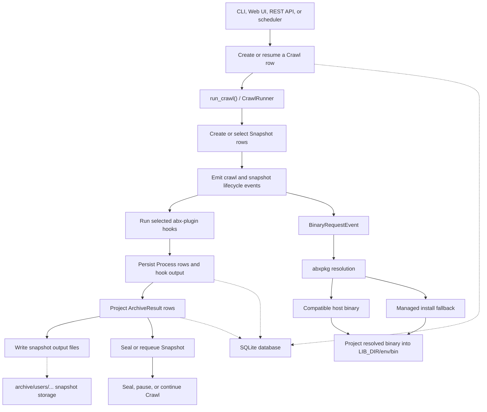
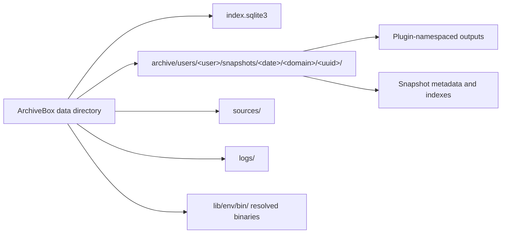
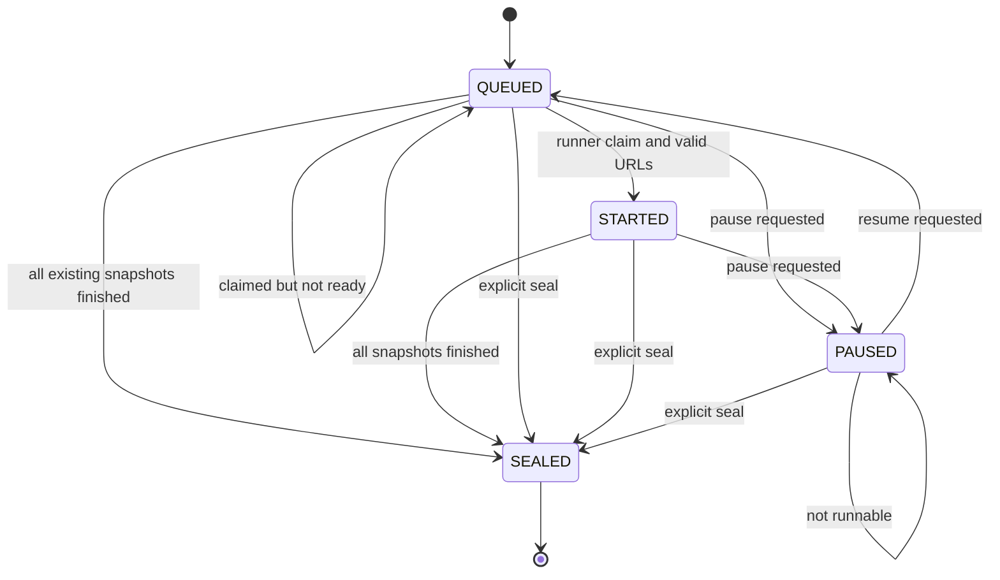
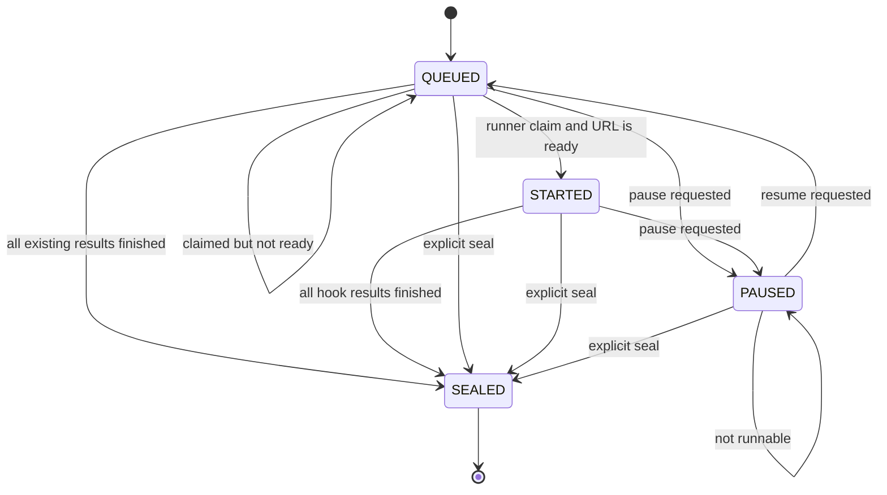
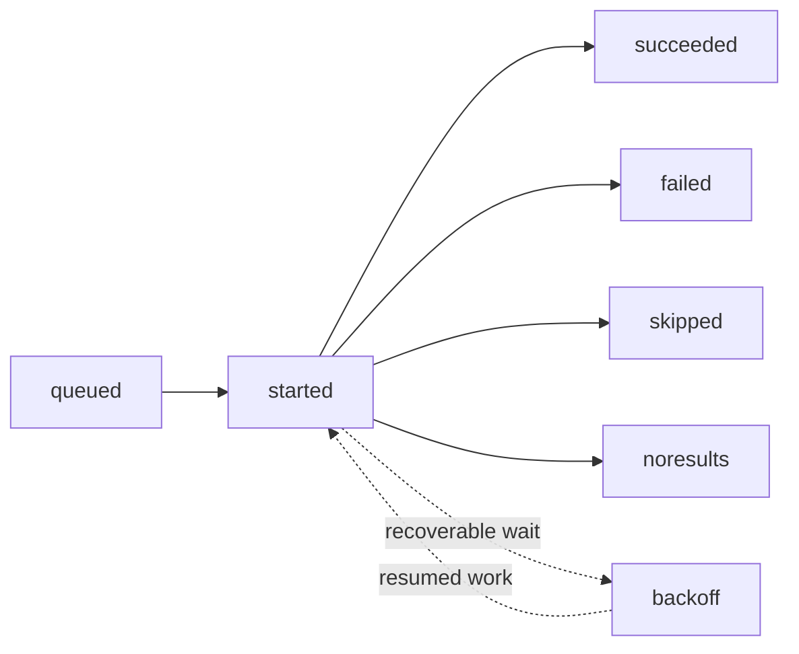

# ArchiveBox Architecture Diagrams

This page is a map of the current execution and persistence paths. The implementation lives primarily in:

- `archivebox/cli/` for CLI entry points
- `archivebox/services/runner/` for scheduling, claiming work, crawl execution, and dependency installation
- `archivebox/crawls/models.py` for the `Crawl` model and its atomic queue transitions
- `archivebox/core/models/` for `Snapshot`, `ArchiveResult`, tags, and snapshot querysets
- `archivebox/services/` for bus event projectors
- `abxpkg` and `abx-plugins` for binary resolution and plugin hooks

## Where behavior belongs

Models own the operations on their objects. Views, admin actions, CLI commands,
and event handlers call those methods; they should not independently implement
state transitions, snapshot imports, or progress calculations.

| Change | Main entry points |
| --- | --- |
| Crawl and snapshot lifecycle | `Crawl.pause/resume/cancel`, `Snapshot.pause/resume/cancel`, `Snapshot.schedule_plugin_run` |
| Import or reconcile a snapshot directory | `Snapshot.load_from_directory`, `create_from_directory`, `reconcile_with_index` |
| JSONL records | Each record model's `to_json()` and `from_json()` |
| Snapshot progress | `Snapshot.get_progress_stats`, with optional prefetched result rows |
| Output manifests and previews | `ArchiveResult.output_file_stats`, `embed_path_db`, and `Snapshot.discover_outputs` |
| Served and exported snapshot pages | `Snapshot.get_html_details_context`, `write_html_details` |
| Queue selection and claims | `services/runner/scheduler.py` and `dispatch.py` |
| Hook execution and event projection | `services/runner/crawl.py` and the individual `services/*_service.py` projectors |
| Progress endpoint | `progressmonitor/views.py` validates access; `report.py` loads bounded data; `presentation.py` renders it |

Core and machine model packages re-export their public classes, so callers use
`archivebox.core.models.Snapshot` and `archivebox.machine.models.Process`.
Splitting those packages does not introduce another layer of object behavior.

`to_json()` returns a typed JSONL record dictionary. `from_json()` applies the
record through the model's import rules, which may create, update, or select an
object; it is not a blind round-trip constructor. Snapshot's older `to_dict()`,
`to_json_str()`, and CSV helpers retain the legacy export format.

## High-Level Execution Flow

ArchiveBox has one normal crawl execution path. CLI commands and web/API actions create or select database rows, then call the same runner. The runner emits lifecycle events, abx-plugin hooks do the extraction work, and service projectors persist processes and results.

Binary discovery and installation always goes through abxpkg. Compatible host binaries are preferred; managed providers are the fallback. Resolved binaries are projected into `LIB_DIR/env/bin` before programmatic use. `LIB_DIR/bin` is only a convenience directory for humans.

## Persistent Data

The database is the source of truth for model state. Snapshot directories contain captured artifacts and rendered metadata. Older collections may also contain legacy timestamp-named snapshot directories.

## `Crawl` Queue Lifecycle

Implemented directly by `Crawl` in `archivebox/crawls/models.py`. The database
row is the durable state; the runner claims `retry_at` with a conditional update
before it performs side effects, then calls the model's explicit lifecycle
methods. There is deliberately no second in-memory state machine that can drift
from the row owned by another process.

A crawl owns a set of snapshots. The runner creates or discovers those snapshots and projects crawl events while the row is `STARTED`; sealing waits for their normal lifecycle to finish. Pausing also schedules child snapshots to pause, and resuming returns the crawl to the runnable queue. Scheduled maintenance is dispatched directly by `CrawlSchedule`; it does not create a synthetic crawl or snapshot.

## `Snapshot` Queue Lifecycle

Implemented directly by `Snapshot` in `archivebox/core/models/snapshots.py`, using the
same conditional `retry_at` claim protocol as `Crawl`.

The runner creates one queued `ArchiveResult` per selected hook, executes those hooks through the shared event bus, and seals the snapshot after every result reaches a final status. The narrow search-index maintenance operation on an already sealed snapshot is the intentional exception; it does not reopen or invent a second general lifecycle path.

## `ArchiveResult` Projection

`ArchiveResult` is not driven by a separate in-memory state machine. The runner creates queued rows, and `ArchiveResultService` projects `ArchiveResultEvent` and `ProcessCompletedEvent` data into them.

`succeeded`, `failed`, `skipped`, and `noresults` are final result statuses. Each row identifies the plugin and hook that produced it and stores structured output, file metadata, timing, and error details.
