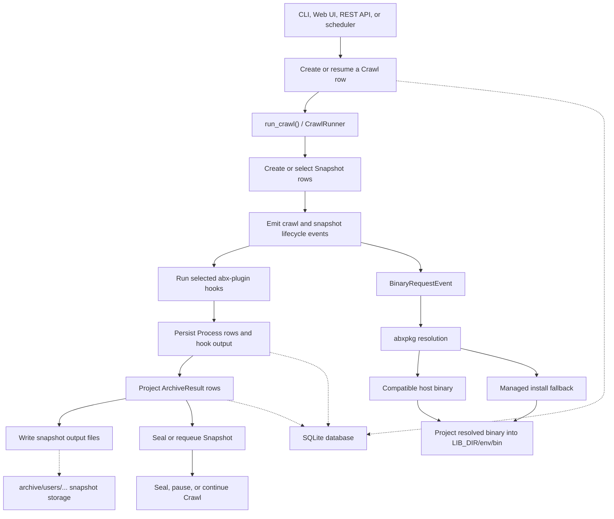
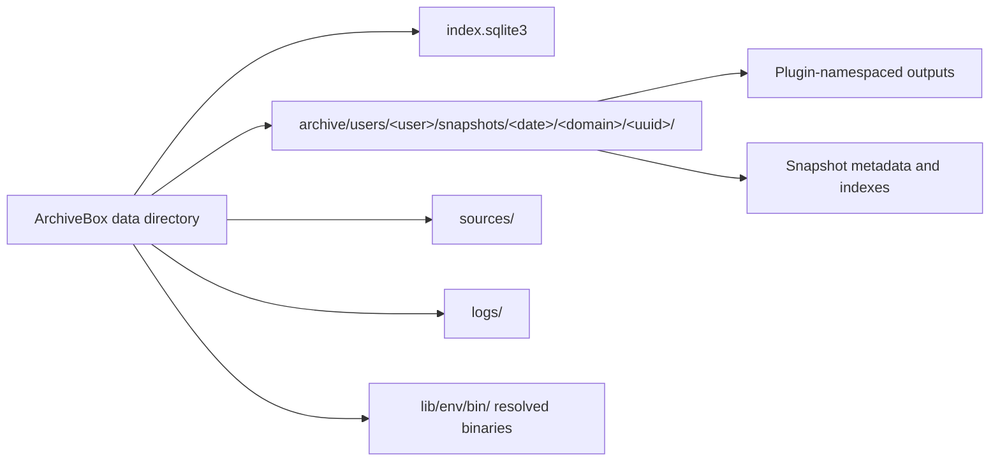
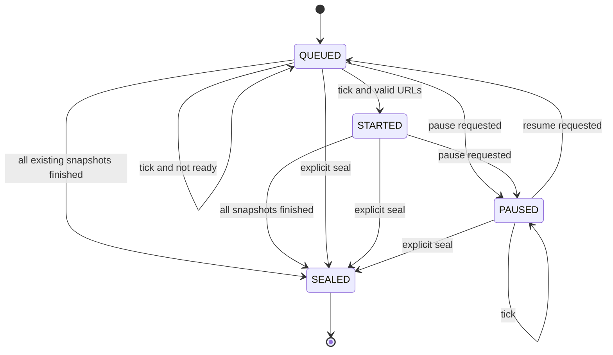
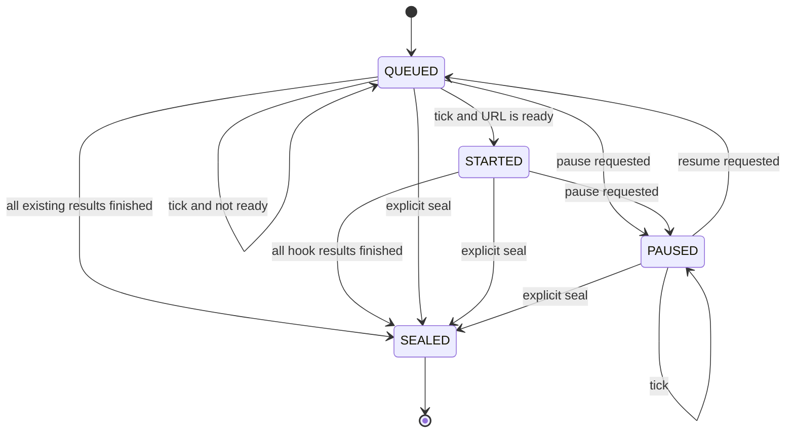
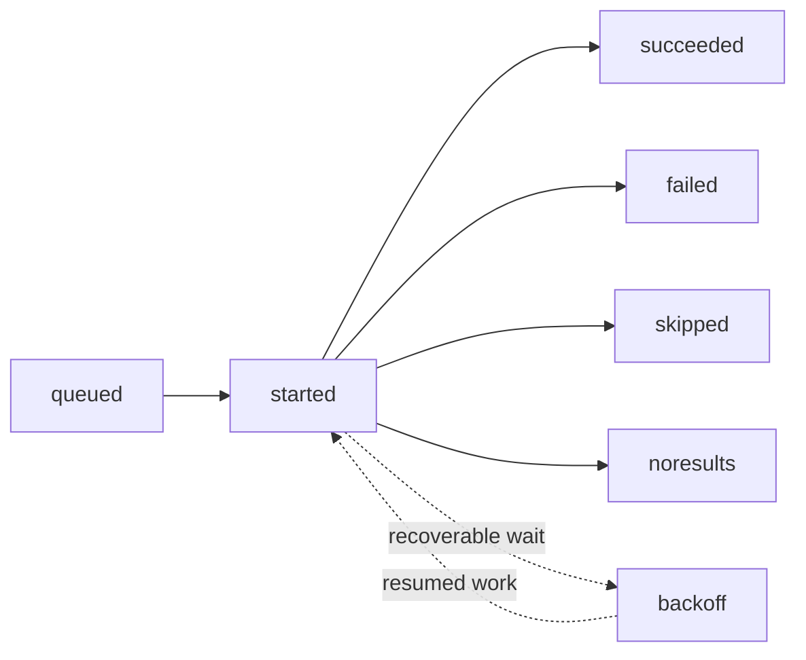

# ArchiveBox Architecture Diagrams

This page is a map of the current execution and persistence paths. The implementation lives primarily in:

- `archivebox/cli/` for CLI entry points
- `archivebox/services/runner.py` for crawl and snapshot execution
- `archivebox/crawls/models.py` for the `Crawl` model and state machine
- `archivebox/core/models.py` for `Snapshot`, `ArchiveResult`, and the `Snapshot` state machine
- `archivebox/services/` for bus event projectors
- `abxpkg` and `abx-plugins` for binary resolution and plugin hooks

## High-Level Execution Flow

ArchiveBox has one normal crawl execution path. CLI commands and web/API actions create or select database rows, then call the same runner. The runner emits lifecycle events, abx-plugin hooks do the extraction work, and service projectors persist processes and results.

Binary discovery and installation always goes through abxpkg. Compatible host binaries are preferred; managed providers are the fallback. Resolved binaries are projected into `LIB_DIR/env/bin` before programmatic use. `LIB_DIR/bin` is only a convenience directory for humans.

## Persistent Data

The database is the source of truth for model state. Snapshot directories contain captured artifacts and rendered metadata. Older collections may also contain legacy timestamp-named snapshot directories.

## `Crawl` State Machine

Implemented by `Crawl` and `CrawlMachine` in `archivebox/crawls/models.py`.

A crawl owns a set of snapshots. Entering `STARTED` creates or discovers those snapshots; sealing waits for their normal lifecycle to finish. Pausing also schedules child snapshots to pause, and resuming returns the crawl to the runnable queue.

## `Snapshot` State Machine

Implemented by `Snapshot` and `SnapshotMachine` in `archivebox/core/models.py`.

The runner creates one queued `ArchiveResult` per selected hook, executes those hooks through the shared event bus, and seals the snapshot after every result reaches a final status. The narrow search-index maintenance operation on an already sealed snapshot is the intentional exception; it does not reopen or invent a second general lifecycle path.

## `ArchiveResult` Projection

`ArchiveResult` is not driven by a separate Python state machine. The runner creates queued rows, and `ArchiveResultService` projects `ArchiveResultEvent` and `ProcessCompletedEvent` data into them.

`succeeded`, `failed`, `skipped`, and `noresults` are final result statuses. Each row identifies the plugin and hook that produced it and stores structured output, file metadata, timing, and error details.
